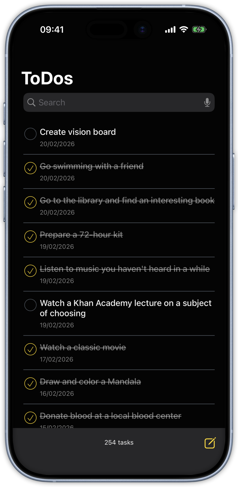
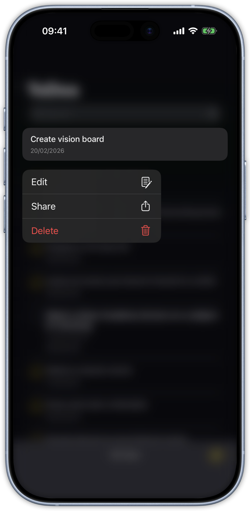
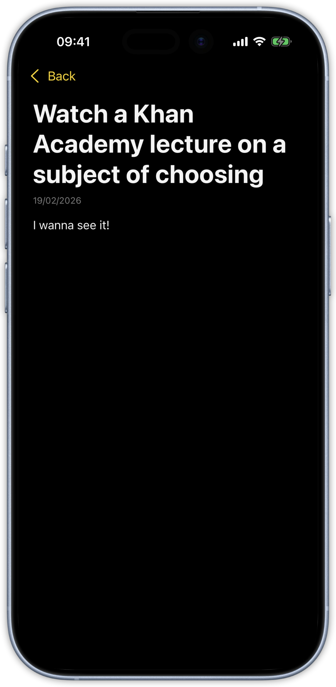
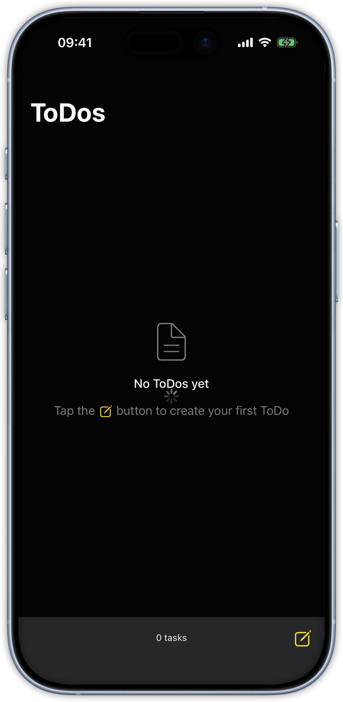
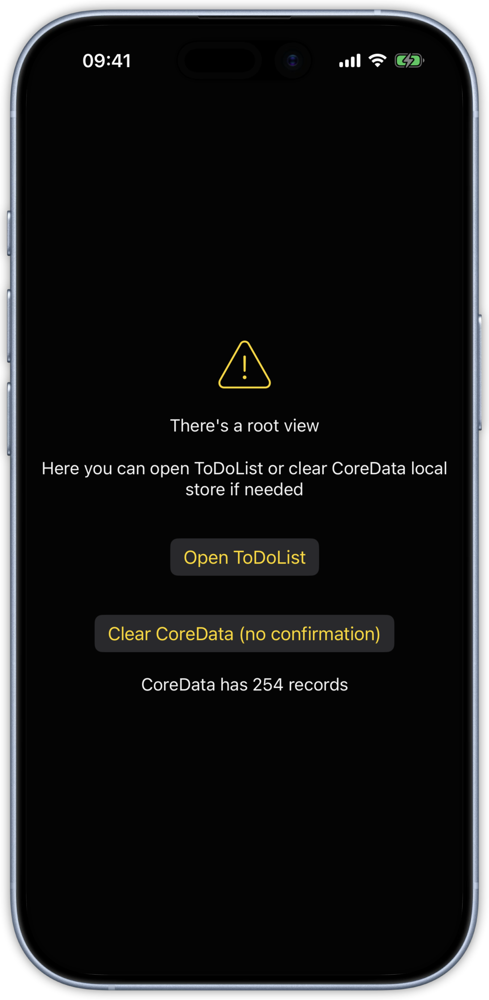

[English version](#ToDoList-iOS-app)

## ToDoList iOS

ToDoList - демо приложение для ведения списка дел с возможностью добавления, редактирования, удаления задач.
 

## Основные функции

- [x] Отображение списка задач на главном экране
- [x] Задача должна содержать название, описание, дату создания и статус (выполнена/не выполнена)
- [x] Возможность добавления новой задачи
- [x] Возможность редактирования существующей задачи
- [x] Возможность удаления задачи
- [x] Возможность поиска по задачам
- [x] При первом запуске приложение должно загрузить список задач из указанного json api
- [x] Обработка создания, загрузки, редактирования, удаления и поиска задач должна выполняться в фоновом потоке
- [x] Интерфейс не должен блокироваться при выполнении операций
- [x] Данные о задачах должны сохраняться в CoreData
- [x] Приложение должно корректно восстанавливать данные при повторном запуске
- [x] Должны быть написаны unit тесты

## Бонусы
- [x] Архитектура Clean Architecture, система разбита на слои, зависимость слоев однонаплавленная, без циклических ссылок
- [x] Навигация NavigationStack с помощью Coordinator
- [x] Для тестов CoreData используется в режиме inMemory
- [x] Приложение разбито на модули, SPM Package
- [x] Подключена дизайн система
- [x] Подключено логирование на базе OSLog
- [x] Тестирование с помощью Swift Testing
- [x] Локализация приложения: русский, английский
- [x] Подключение зависимостей через DI контейнер
- [x] Моковые координатор и DI контейнер для корректной работы Swift Preview

## Требования заказчика
[Дизайн приложения (Figma)](https://www.figma.com/design/ElcIDP3PIp5iOE4dCtPGmd/Задачи?node-id=0-1&p=f&t=3Xts3fHljC38qNLI-0)
[Техническое задание](https://disk.360.yandex.ru/i/HiTz0LSbJfFWwA)
[DummyJson API](https://dummyjson.com/todos)
[DummyJson API Doc](https://dummyjson.com/docs/todos#todos-all)

| Системные требования          | Значение                   |
| ----------------------------- | -------------------------- |
| Версия iOS                    | Minimum 16.0               |
| Платформа                     | iPhone                     |
| Ориентация устройства         | Портрет (только)           |
| Шрифт                         | Системный                  | 

### Стек технологий 

- **UI**: SwiftUI
- **Architecture**: MVVM + Coordinator, Clean Architecture
- **Dependencies**: Swift Package Manager (SPM)
- **Persistence**: Core Data
- **Storage**: UserDefaults (для настроек)
- **Networking**: JSON API (DummyJSON)
- **Testing**: Swift Testing

### Тесты
- Unit tests

### Инструменты
- Xcode
- Figma
- Postman
 
  
### Автор 
[Сергей Кеменов](https://github.com/SKemenov)

[В начало](#ToDoList-iOS)

# ToDoList iOS app

ToDoList is a demo iOS application for managing a task list with support for adding, editing, deleting, and searching tasks.

## Core Features

- [x] Display task list on the main screen
- [x] Each task includes: title, description, creation date, and status (completed / not completed)
- [x] Add a new task
- [x] Edit an existing task
- [x] Delete a task
- [x] Search through tasks
- [x] On first launch, the app loads the initial task list from a JSON API
- [x] All create / load / update / delete / search operations are performed in a background thread
- [x] The UI remains responsive during any data operations (no freezing)
- [x] Tasks are persistently stored using **Core Data**
- [x] The app correctly restores data on subsequent launches
- [x] Unit tests are implemented

## Bonus / Advanced Features

- [x] Clean Architecture — the system is divided into clear layers with unidirectional dependencies (no circular references)
- [x] Navigation using **NavigationStack** + **Coordinator** pattern
- [x] Core Data is used in **in-memory** mode for tests
- [x] The project is split into **modules** using **Swift Package Manager (SPM)**
- [x] Implemented **design system**
- [x] Logging using **OSLog**
- [x] Testing with **Swift Testing**
- [x] App **localization**: English + Russian
- [x] **Dependency Injection** container
- [x] Mock coordinator and DI container for correct **SwiftUI Previews**

## Screenshots

## Customer Requirements / References

[Design (Figma)](https://www.figma.com/design/ElcIDP3PIp5iOE4dCtPGmd/Задачи?node-id=0-1&p=f&t=3Xts3fHljC38qNLI-0)
[Technical specification](https://disk.360.yandex.ru/i/HiTz0LSbJfFWwA)
[DummyJSON API (todos)](https://dummyjson.com/todos)
[DummyJSON API Documentation](https://dummyjson.com/docs/todos#todos-all)

| System Requirement           | Value              |
|------------------------------|--------------------|
| iOS version                  | Minimum 16.0       |
| Platform                     | iPhone only        |
| Device orientation           | Portrait only      |
| Font                         | System font        |

## Tech Stack

- **UI**: SwiftUI
- **Architecture**: MVVM + Coordinator, Clean Architecture
- **Dependencies**: Swift Package Manager (SPM)
- **Persistence**: Core Data
- **Storage**: UserDefaults (for settings)
- **Networking**: JSON API (DummyJSON)
- **Testing**: Swift Testing

## Tests

- Unit tests

## Tools Used

- Xcode
- Figma
- Postman

## Author

[Sergey Kemenov](https://github.com/SKemenov)
